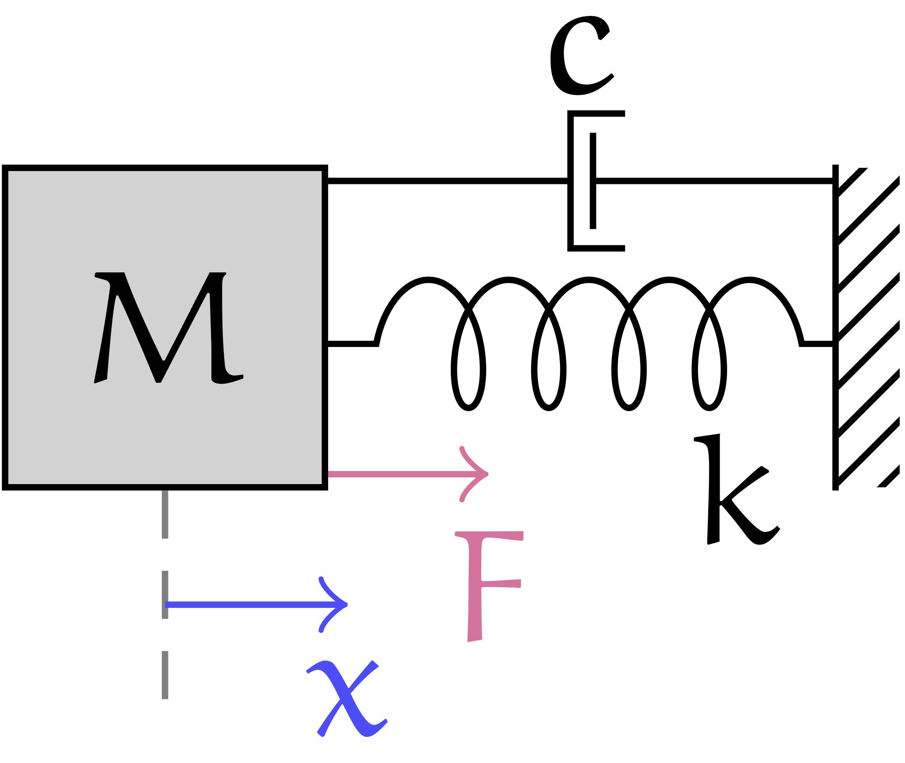

# Neu4mes
[](https://opensource.org/licenses/MIT)  [](https://travis-ci.org/tonegas/neu4mes)  [](https://coveralls.io/github/tonegas/neu4mes?branch=master)
<a name="readme-top"></a>
## Structured neural network framework for modeling and control mechanical system
_Structured neural networks_ (SNNs) are a new neural networks concept. 
These networks base their structure on mechanical and control theory laws. 

The framework's goal is to allow the users fast modeling and control of a mechanical system such as an autonomous vehicle, an industrial robot, a walking robot, a flying drone.

The workflow that the framework inspires you to have is as follows:

Using a conceptual representation of your mechanical system the framework uses the structured neural network for modelling the considered mechanical device. 
Providing suitable experimental data, the framework will realize an effective training of the neural models by appropriately choosing all the hyper-parameters.
The framework will allow the user to synthesize and train a structured neural network that will be used as a control system in a few simple steps and without the need to perform new experiments. 
The realized neural controller will be exported using C language or ONNX, and it will be ready to use.

<!-- TABLE OF CONTENTS -->
<details>
  <summary>Table of Contents</summary>
  <ol>
    <li>
      <a href="#settingstarted">Getting Started</a>
    </li>
    <li>
      <a href="#basicfunctionalities">Basic Functionalities</a>
      <ul>
        <li><a href="#structuredneuralmodel">Build the structured neural model</a></li>
        <li><a href="#neuralizemodel">Neuralize the structured neural model</a></li>
        <li><a href="#loaddataset">Load the dataset</a></li>
        <li><a href="#trainmodel">Train the structured neural network</a></li>
      </ul>
    </li>
  </ol>
</details>

<!-- GETTING STARTED -->
## Getting Started
<a name="settingstarted"></a>

### Prerequisites

You can install the dependencies of the neu4mes framework from PyPI via:
  ```sh
  pip install -r requirements.txt
  ```

<p align="right">(<a href="#readme-top">back to top</a>)</p>

## Basic Functionalities
<a name="basicfunctionalities"></a>
### Build the structured neural model
<a name="structuredneuralmodel"></a>
The structured neural model is defined by a list of inputs by a list of outputs and by a list of relationships that link the inputs to the outputs.

Let's assume we want to model one of the best-known linear mechanical systems, the mass-spring-damper system.

<p align="center">

</p>

The system is defined as the following equation:
```math
M \ddot x  = - k x - c \dot x + F
```

Suppose we want to estimate the value of the future position of the mass given the initial position and the external force.

In the neu4mes framework we can build an estimator in this form:
```python
x = Input('x')
F = Input('F')
x_z = Output(x.z(-1), Linear(x.tw(1))+Linear(F))
```

The first thing we define the input variable of the system.
Input variabiles can be created using the `Input` function.
In our system we have two inputs the position of the mass, `x`, and the external force, `F`, exerted on the mass.
The `Output` function is used to define an estimator of a variable.
In this case for estimating the future position of the mass `x_z` (the next instant, using the **Z-transform** notation),
the `Output` gets two inputs, the first is the variable to be estimated and the second is the structure of the estimator.
Let's explain some of the functions used:
1. The `z(...)` method can be used on an `Input` variable to compute a time shift.
In our case `z(-1)` indicates the unit advance.
2. The `tw(...)` function is used to extract a time window from a signal. 
In particular we extract a time window of 1 second.
3. The `Linear(...)` function to build an FIR filter with the tunable parameters on our input variable.

So we are creating an estimator for the variable `x` at the instant following the observation (the future position of the mass) by building an 
observer that has a mathematical structure equal to the one shown below:
```math
x[1] = \sum_{k=0}^{N_x-1} x[-k]\cdot h_x[(N_x-1)-k] + F[0]\cdot h_F
```
Where the variables $N_x$, and $h_f$ also the values of the vectors $h_x$ are still unknowns.
Regarding $N_x$, we know that the window lasts one second but we do not know how many samples it corresponds to and this depends on the discretization interval.
The formulation above is equivalent to the formulation of the discrete time response of the system
if we choose $N_x = 3$ and $h_x$ equal to the characteristic polynomial and $h_f = T^2/M$ (with $T$ sample time).
Our formulation is more general and can take into account the noise of the measured variable using a bigger time window.
The estimator can also be seen as the composition of the force contributions due to the position and velocity of the mass plus the contribution of external forces.

### Neuralize the structured neural model
<a name="neuralizemodel"></a>

Let's now try to train our observer using the data we have.
We perform:
```python
massSpringDamper = Neu4mes()
massSpringDamper.addModel(x_z)
massSpringDamper.neuralizeModel(0.01)
```
Let's create a **neu4mes** object and add our estimator to the list of models that to be estimated using the `addModel` function.
The function `neuralizeModel` is used to perform the discretization. The parameter of the function is the sampling time and it will be chosen based on the data we have available.

### Load the dataset
<a name="loaddataset"></a>

```python
data_struct = ['time','x','x_s','F']
data_folder = './datasets/springdamper/data/'
massSpringDamper.loadData(data_struct, folder = data_folder)
```
Finally, the dataset is loaded. **neu4mes** loads all the files that are in a folder.

### Train the structured neural network
<a name="trainmodel"></a>
Using that files the training is performed on the model.

```python
massSpringDamper.trainModel()
```

<p align="right">(<a href="#readme-top">back to top</a>)</p>
